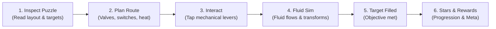
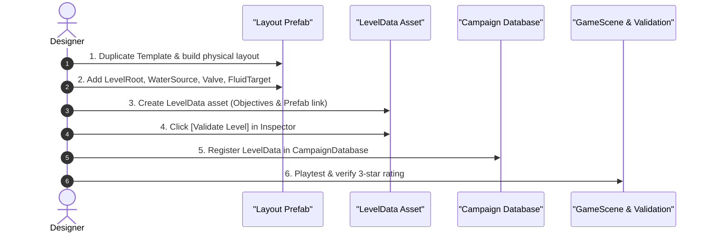
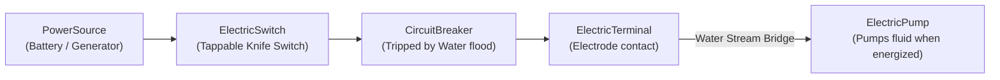

# HOUSEFLOW: Level Designer & Puzzle Mechanics Guide

Welcome to the **HOUSEFLOW Level Design Guide**! This comprehensive handbook explains how to build, wire, balance, and validate puzzle levels in Unity for HOUSEFLOW.

---

## Table of Contents
1. [Core Design Philosophy & Puzzle Loop](#1-core-design-philosophy--puzzle-loop)
2. [Step-by-Step Level Creation Workflow](#2-step-by-step-level-creation-workflow)
3. [Component & Prefab Catalog](#3-component--prefab-catalog)
   - [A. Level Infrastructure](#a-level-infrastructure)
   - [B. Fluid & Drainage](#b-fluid--drainage)
   - [C. Mechanical & Plumbing](#c-mechanical--plumbing)
   - [D. Thermal & Thermodynamics](#d-thermal--thermodynamics)
   - [E. Electricity & Circuits (World 2)](#e-electricity--circuits-world-2)
   - [F. Objectives & Scoring](#f-objectives--scoring)
4. [Camera Framing, Dimensions & Lighting](#4-camera-framing-dimensions--lighting)
5. [Level Archetypes & Reference Layouts](#5-level-archetypes--reference-layouts)
6. [Pre-Flight Validation & Troubleshooting](#6-pre-flight-validation--troubleshooting)

---

## 1. Core Design Philosophy & Puzzle Loop

HOUSEFLOW is a physics-based plumbing and environmental puzzle game designed for **mobile portrait (9:16)**. Players solve domestic fluid-flow puzzles by interacting with mechanical valves, switches, gates, and heating/cooling elements.



### The 4 Design Pillars
1. **Tactile Clarity**: Every interactable element (Valve, Switch, Breaker) must be visibly distinct and easily tappable on a mobile touchscreen (minimum touch target radius $\ge 0.5$ Unity units).
2. **Determinism**: Water simulation must behave reliably. Puzzles should reward clever routing and timing, never random physics chaos or pixel-hunting.
3. **Multi-State Transformation**: Fluid is not just liquid water—it heats into steam to rise, condenses on cool plates, and conducts electricity when electrified.
4. **No Failure Penalty**: Restarting a level is instantaneous. Levels should encourage experimentation without timer-induced anxiety.

---

## 2. Step-by-Step Level Creation Workflow

Building a new HOUSEFLOW level consists of **6 simple steps**:



### Step 1: Create the Layout Prefab
1. In the Project window, navigate to `Assets/Prefabs/Levels/`.
2. Duplicate `LayoutLevel.prefab` or create a new empty Prefab named `LayoutLevel_WorldX_LevelY.prefab`.
3. Open the prefab in Prefab Isolation Mode.
4. Ensure the root GameObject has the **`LevelRoot`** component attached.

### Step 2: Build the Puzzle Geometry & Place Objects
1. Create a child GameObject named `Boundaries` and add static `BoxCollider2D` walls to contain the fluid.
2. Add a `WaterSource` where fluid enters the room.
3. Add a `Valve` to control the water source (or multiple valves for branching pipes).
4. Add a `FluidTarget` container where fluid must be collected.
5. Add any required environmental mechanics (Burners, Fans, Circuit Breakers, Gates).
6. Save and close the Prefab.

### Step 3: Create the LevelData ScriptableObject
1. In `Assets/Data/Levels/`, right-click $\rightarrow$ **Create $\rightarrow$ HOUSEFLOW $\rightarrow$ Level $\rightarrow$ Level Data**.
2. Name the asset `LevelData_W1_L02.asset`.
3. Fill in the Inspector fields:
   - **Level Id**: Unique ID (e.g. `w1_level_002`).
   - **Display Name**: Player-facing name (e.g. *"The Boiling Teapot"*).
   - **World**: `1` (Plumbing Apprentice) or `2` (Electrified Basement).
   - **Tier**: Sequence index within the world.
   - **Difficulty**: `Easy`, `Medium`, or `Hard`.
   - **Layout Prefab**: Drag your `LayoutLevel_W1_LevelY.prefab` here.

### Step 4: Configure Objectives
1. In the `LevelData` Inspector under **Primary Objective**:
   - **Objective Type**: `DeliverFluidToContainer`.
   - **Target Id**: Must match the `Target Id` string on your `FluidTarget` component (e.g. `main_drain`).
   - **Required Particle Count**: Number of fluid particles needed to clear (e.g. `10`).
   - **Accepted Fluid**: `Water`, `Steam`, etc.
2. Configure **Optional Objectives** (1 Star each):
   - Optional Objective 1: Secondary container or fluid efficiency.
   - Optional Objective 2: Time limit or zero-spill challenge.

### Step 5: Validate the Level
1. At the bottom of the `LevelData` Inspector, click **`✓ Validate Level`**.
2. If any warning (⚠) or error (✗) appears, fix the indicated missing references or IDs. A level is only ready to ship when all checks show green (✓).

### Step 6: Add to Campaign Database
1. Select `Assets/Data/CampaignDatabase_Main.asset`.
2. Find the appropriate World (World 1 or World 2).
3. Add your new `LevelData` asset into the **Levels** list in sequential order.
4. Press Play in `GameScene.unity` to playtest!

---

## 3. Component & Prefab Catalog

### A. Level Infrastructure

#### 1. `LevelRoot`
- **Script**: `Assets/Scripts/HouseFlow/Level/LevelRoot.cs`
- **Location**: Root GameObject of every level layout prefab.
- **Purpose**: Discovers all interactive and puzzle components in the level hierarchy, manages clean deterministic restarts, and coordinates fluid cleanup.
- **Key Settings**:
  - `boundaryColliders`: (Optional) Static 2D colliders bounding the screen edges.
  - `recycleOutOfBoundsParticles`: If true, particles that fall through accidental gaps are recycled.
- **Designer Rule**: Never instantiate more than one `LevelRoot` per level prefab. Always keep it at the top of the hierarchy.

#### 2. Static Boundaries & Pipe Walls
- **Components**: `SpriteRenderer` + `BoxCollider2D` / `CompositeCollider2D` (Static).
- **Purpose**: Guides water, holds reservoirs, and channels fluid streams.
- **Friction & Bounciness**: Keep default Physics Material 2D (`friction = 0.2`, `bounciness = 0.05`) so fluid particles slide smoothly without sticking or bouncing erratically.

---

### B. Fluid & Drainage

#### 1. `WaterSource`
- **Script**: `Assets/Scripts/HouseFlow/Fluid/WaterSource.cs`
- **Prefab**: Child of `LayoutLevel.prefab`
- **Purpose**: The emitter spout that pours fluid into the scene.
- **Key Inspector Settings**:
  | Field | Type | Default | Description |
  | :--- | :--- | :--- | :--- |
  | `startsEmitting` | `bool` | `false` | If true, pours immediately upon level start. If controlled by a Valve, leave `false`. |
  | `emissionRate` | `float` | `8` | Fluid particles spawned per second. (Keep between 6–12 for optimal mobile performance). |
  | `emissionDirection` | `Vector2` | `(0, -1)` | Normalized launch vector. `(0, -1)` pours straight down. |
  | `emissionForce` | `float` | `3.0` | Initial exit velocity applied to particles. |
  | `maxEmittedParticles`| `int` | `0` | Total particles before auto-shutoff (`0` = infinite while active). |
  | `fluidParticlePrefab`| `GameObject`| `FluidParticle.prefab` | Must be assigned! |
  | `fluidType` | `FluidType` | `Water` | Starting state: `Water`, `HotWater`, `Steam`, or `Gas`. |
  | `spawnRadius` | `float` | `0.05` | Small jitter radius to prevent particles stacking in single column. |

#### 2. `FluidTarget`
- **Script**: `Assets/Scripts/HouseFlow/Fluid/FluidTarget.cs`
- **Purpose**: The destination sink, bucket, or pipe inlet where fluid must be delivered.
- **Required Components**: `Collider2D` with **`isTrigger = true`**.
- **Key Inspector Settings**:
  | Field | Type | Default | Description |
  | :--- | :--- | :--- | :--- |
  | `targetId` | `string` | `"main_drain"` | **CRITICAL**: Must match the `targetId` in `LevelData`'s objective! |
  | `acceptedType` | `FluidType`| `Water` | Only particles matching this type are accepted. Particles of wrong type are ignored. |
  | `capacity` | `int` | `20` | Max particles the container can visually hold. |
- **Designer Rule**: Always add visual boundaries (left wall, right wall, floor) around the trigger volume so particles collect visually before disappearing into the drain.

#### 3. `FluidParticle`
- **Prefab**: `Assets/Prefabs/Particles/FluidParticle.prefab`
- **Script**: `Assets/Scripts/HouseFlow/Fluid/FluidParticle.cs`
- **Physics**: `CircleCollider2D` (radius `0.1`), `Rigidbody2D` (Dynamic, mass `0.05`, gravity scale `1.0`).
- **Behaviors**:
  - Automatically evaporates into steam when temperature $\ge 100^\circ\text{C}$ (gravity reverses, particle floats upward).
  - Automatically turns cyan and conducts electric shock when in contact with live terminals or electrified water.

---

### C. Mechanical & Plumbing

#### 1. `Valve`
- **Script**: `Assets/Scripts/HouseFlow/Mechanical/Valve.cs`
- **Purpose**: Tappable faucet handle or wheel that turns a connected `WaterSource` on or off.
- **Required Components**: `Collider2D` (`BoxCollider2D` or `CircleCollider2D`) so the player's tap raycast detects it.
- **Key Inspector Settings**:
  | Field | Type | Default | Description |
  | :--- | :--- | :--- | :--- |
  | `targetSource` | `WaterSource` | `None` | **CRITICAL**: Drag the `WaterSource` GameObject to control here! |
  | `isOpenInitially` | `bool` | `false` | Starting state at puzzle launch. |
  | `rotationAngle` | `float` | `90.0` | Visual degrees the handle rotates when toggled. |
  | `toggleDuration` | `float` | `0.25` | Animation time in seconds for the handle rotation. |

#### 2. `PneumaticGate`
- **Script**: `Assets/Scripts/HouseFlow/Mechanical/PneumaticGate.cs`
- **Purpose**: A sliding barrier or doorway that blocks or allows fluid to pass. Can be operated directly by tapping or driven by pneumatic pressure.
- **Required Components**: `BoxCollider2D` (blocking fluid) and optionally `IInteractable` tap detection.
- **Key Inspector Settings**:
  | Field | Type | Default | Description |
  | :--- | :--- | :--- | :--- |
  | `openOffset` | `Vector2` | `(0, 1.5)` | Direction and distance the gate slides when opened. |
  | `moveDuration` | `float` | `0.4` | Smooth glide duration in seconds. |
  | `startsOpen` | `bool` | `false` | Initial position state. |
  | `requiredPressure` | `float` | `10.0` | Pressure needed to automatically lift if driven by bladders. |

#### 3. `Balloon` & `CounterweightBladder`
- **Scripts**: `Balloon.cs`, `CounterweightBladder.cs`
- **Purpose**: Mechanical counterbalances.
  - `Balloon`: Expands and floats upward when filled with rising steam/hot air, pulling cables or opening skylights.
  - `CounterweightBladder`: Fills with heavy liquid water, sinking downward under gravity to pull open connected gates.

#### 4. `AirflowSource` (Fan / Blower)
- **Prefab**: `Assets/Prefabs/Mechanical/Fan.prefab`
- **Script**: `Assets/Scripts/HouseFlow/Mechanical/AirflowSource.cs`
- **Purpose**: Blows air currents that push fluid particles, balloons, or steam horizontally or vertically.
- **Key Inspector Settings**:
  - `airflowDirection`: Vector pointing airflow direction (e.g. `(1, 0)` blows right).
  - `airflowForce`: Strength of propulsion (recommended: `4.0`–`8.0`).
  - `maxDistance`: Maximum range of the wind column.
  - `isActiveInitially`: Can be turned on/off by switches or valves.

---

### D. Thermal & Thermodynamics

#### 1. `HeatSource` (Burner / Heater)
- **Prefab**: `Assets/Prefabs/Mechanical/Burner.prefab`
- **Script**: `Assets/Scripts/HouseFlow/Thermal/HeatSource.cs`
- **Purpose**: Radiates heat into nearby fluid particles or thermal objects.
- **Key Inspector Settings**:
  - `temperature`: Temperature in $^\circ\text{C}$ (e.g. `150` for boiling water into steam).
  - `radius`: Circular area of thermal effect.
  - `isActiveInitially`: Starting state.
  - `heatTransferRate`: How fast heat transfers into passing water droplets.

#### 2. `CoolingSource` (Chill Plate)
- **Prefab**: `Assets/Prefabs/Mechanical/Chill Plate.prefab`
- **Script**: `Assets/Scripts/HouseFlow/Thermal/CoolingSource.cs`
- **Purpose**: Extracts heat from steam, causing it to condense back into liquid water droplets and fall downward.
- **Key Inspector Settings**:
  - `targetTemperature`: Low temperature in $^\circ\text{C}$ (e.g. `5` or `0`).
  - `coolingRate`: Rate of condensation.

#### 3. `Boiler`
- **Prefab**: `Assets/Prefabs/Mechanical/Boiler.prefab`
- **Script**: `Assets/Scripts/HouseFlow/Mechanical/Boiler.cs`
- **Purpose**: Enclosed tank that collects liquid water at the bottom, heats it via an attached `HeatSource`, and vents pressurized steam through an exhaust nozzle at the top.

---

### E. Electricity & Circuits (World 2)

World 2 introduces electrical circuits and fluid conductivity. Electrified water conducts shock and powers mechanisms, but flooding circuits trips safety breakers!



#### 1. `PowerSource`
- **Script**: `Assets/Scripts/HouseFlow/Electricity/PowerSource.cs`
- **Purpose**: The root voltage generator supplying electricity to switches and machines.
- **Key Settings**: `voltage` (e.g. `12` or `24`), `isActiveInitially` (`true`).

#### 2. `ElectricSwitch`
- **Script**: `Assets/Scripts/HouseFlow/Electricity/ElectricSwitch.cs`
- **Purpose**: A player-tappable knife switch (`IInteractable`) that closes or opens an electrical circuit.
- **Required Components**: `Collider2D` for tap detection.
- **Key Settings**: `upstreamSource` (link to `PowerSource`), `isOpenInitially` (starting state), `toggleAngle` (visual rotation).

#### 3. `CircuitBreaker`
- **Script**: `Assets/Scripts/HouseFlow/Electricity/CircuitBreaker.cs`
- **Purpose**: Safety fuse box. If water particles spray directly onto it, it sparks and trips open (`trippedByWater = true`), killing power downstream!
- **Interaction**: Once the water is diverted or dried, the player can tap the breaker to manually reset it.

#### 4. `ElectricTerminal` (Electrode)
- **Script**: `Assets/Scripts/HouseFlow/Electricity/ElectricTerminal.cs`
- **Purpose**: Metal contacts that conduct electricity into fluid or across fluid streams.
- **Mechanic**: If water flows between two terminals, the liquid bridges the gap, completing the circuit! Passing water becomes electrified (cyan glow).

#### 5. `ElectricPump`
- **Script**: `Assets/Scripts/HouseFlow/Electricity/ElectricPump.cs`
- **Purpose**: Motorized suction and propulsion pump. Only runs when supplied with active power. Sucks in fluid and blasts it uphill through pipes.

---

### F. Objectives & Scoring

Objectives determine how the player completes a level and earns up to **3 Stars**:

| Star | Requirement | Where Defined |
| :---: | :--- | :--- |
| **⭐ Star 1** | Clear the **Primary Objective** (Mandatory). | `LevelData.primaryObjective` |
| **⭐⭐ Star 2** | Clear **Optional Objective 1** (e.g. Secondary drain or efficiency). | `LevelData.optionalObjectives[0]` |
| **⭐⭐⭐ Star 3** | Clear **Optional Objective 2** (e.g. Complete under time limit). | `LevelData.optionalObjectives[1]` |

#### Supported Objective Types
1. **`DeliverFluidToContainer`** (Standard Clear):
   - Deliver $N$ particles of specified `FluidType` to the `FluidTarget` with matching `targetId`.
2. **`DeliverSecondaryFluid`** (Bonus Star):
   - Fill a secondary overflow container or flower pot with excess fluid.
3. **`TimeLimit`** (Speed Star):
   - Solve the puzzle and deliver the required fluid within $X$ seconds.

> [!IMPORTANT]
> **Avoid MaxSpillObjective**: The Max Spill objective is deferred in current milestones. Always prefer `DeliverFluidToContainer` or `TimeLimit` for optional stars.

---

## 4. Camera Framing, Dimensions & Lighting

All HOUSEFLOW levels are viewed through a single fixed 2D orthographic camera configured for **Mobile Portrait (9:16)**.

```
       +──────────────────────────────────────+  Y = +4.5 (Top Edge)
       |   [Top HUD: Title, Progress, Menu]   |  Safe Margin: Y > +3.5
       |──────────────────────────────────────|
       |                                      |
       |                                      |
       |             ACTIVE PUZZLE            |  Playable Area:
       |                 SPACE                |  X in [-2.2, +2.2]
       |                                      |  Y in [-3.2, +3.2]
       |                                      |
       |──────────────────────────────────────|
       |   [Bottom HUD: Tool Tray & Quotas]   |  Safe Margin: Y < -3.5
       +──────────────────────────────────────+  Y = -4.5 (Bottom Edge)
     X = -2.53                              X = +2.53
```

### Camera Standards
- **Position**: `(0, 0, -10)`
- **Orthographic Size**: `4.5` (Total height = `9.0` units; total width at 9:16 = `5.06` units).
- **Near Clip Plane**: `0.3` | **Far Clip Plane**: `1000`
- **Sprite Z-Position**: All puzzle sprites and colliders must be at **$Z = 0.0$**.

### Safe Playable Bounds
- **Horizontal**: Keep all puzzle elements between **$X = -2.2$** and **$X = +2.2$**.
- **Vertical**: Keep all puzzle elements between **$Y = -3.2$** and **$Y = +3.2$**.
- Elements outside these coordinates risk being hidden beneath top HUD bars or bottom tool docks on notched phones.

### 2D Lighting & Materials
- **Global Light 2D**: Intensity = **`1.0`**, Color = White (`#FFFFFF`).
- **Sprite Materials**: Use `Sprite-Lit-Default` (included in URP 2D).
- **Sorting Layers**:
  - `Background` (Order `-10`): Wallpaper, tiles, background walls.
  - `Default` (Order `0`): Pipes, valves, burners, gates, machinery.
  - `Fluids` (Order `5`): Fluid particles, steam clouds, splash VFX.
  - `Foreground` (Order `10`): Window frames, decorative overlays.

---

## 5. Level Archetypes & Reference Layouts

### Archetype 1: Basic Gravity Routing (World 1, Early)
- **Goal**: Teach player how to tap a Valve to open flow into a drain.
- **Setup**:
  - `WaterSource` at top center `(0, 2.5, 0)` with `startsEmitting = false`.
  - `Valve` at `(-1.5, 1.5, 0)` targeting the water source.
  - Slanted funnel pipe guiding fluid downwards.
  - `FluidTarget` (`main_drain`) at bottom `(0, -2.5, 0)`.
- **Player Action**: Tap the valve handle $\rightarrow$ water pours down pipe into drain.

### Archetype 2: Thermal Steam Evaporation (World 1, Mid)
- **Goal**: Player must heat water into steam to lift it over a high barrier into an elevated collector.
- **Setup**:
  - `WaterSource` pours into a lower boiler/pan.
  - `HeatSource` (Burner) under the pan set to $150^\circ\text{C}$.
  - When water reaches pan, it converts to `Steam` and floats upward.
  - `CoolingSource` (Chill plate) at top condenses steam back into droplets over an elevated collector.
- **Player Action**: Open water valve, ignite burner switch, route condensed droplets into target.

### Archetype 3: The Conductive Bridge (World 2, Electrical)
- **Goal**: Use a water stream to close an electrical gap and power an extraction pump.
- **Setup**:
  - `PowerSource` connected to `ElectricSwitch`.
  - Circuit has a physical air gap between two `ElectricTerminal` electrodes.
  - Water valve sprays water across the gap, completing the circuit.
  - Energized circuit starts an `ElectricPump` that clears a flooded basement.
- **Player Action**: Close electrical knife switch $\rightarrow$ open water valve $\rightarrow$ stream bridges circuit $\rightarrow$ pump activates and empties room.

---

## 6. Pre-Flight Validation & Troubleshooting

Before committing or pushing any level, verify this checklist:

### Designer Pre-Flight Checklist
- [ ] **Prefab Root**: Does the root GameObject have `LevelRoot` attached?
- [ ] **Valve References**: Does every `Valve` have its `targetSource` field linked in the Inspector?
- [ ] **Collider Setup**: Does every interactable (`Valve`, `Switch`, `Breaker`) have a `Collider2D` so taps work?
- [ ] **Target ID Match**: Does the `FluidTarget.targetId` string exactly match the `LevelData.primaryObjective.targetId`?
- [ ] **Trigger Collider**: Does the `FluidTarget` have `isTrigger = true` on its collider?
- [ ] **Safe Bounds**: Are all gameplay elements within $X \in [-2.2, 2.2]$ and $Y \in [-3.2, 3.2]$?
- [ ] **Validation Button**: Did you click **`✓ Validate Level`** on the `LevelData` asset with **0 errors**?
- [ ] **Campaign Registration**: Is the `LevelData` added to `CampaignDatabase_Main.asset`?

### Common Issues & Quick Fixes

| Symptom | Cause | Solution |
| :--- | :--- | :--- |
| **Tapping a Valve does nothing.** | Missing collider or missing target source. | Add a `BoxCollider2D` to the Valve GameObject and assign `targetSource` in the Inspector. |
| **Water falls straight through the drain.** | `FluidTarget` collider is not a trigger, or target is at capacity. | Check `isTrigger = true` on the `FluidTarget`'s collider. Ensure `capacity` is sufficient. |
| **"No FluidTarget with id 'xxx' found" in console.** | Target ID mismatch between `LevelData` and `FluidTarget`. | Verify the exact spelling of `targetId` in both assets. |
| **Particles fall behind walls or are invisible.** | Z-position clipping or sorting layer issue. | Ensure camera is at $Z = -10$, sprites are at $Z = 0$, and particles are on sorting layer `Fluids` (Order 5). |
| **Circuit breaker won't reset.** | Water particles are still touching the breaker trigger. | Divert the water stream away from the breaker before tapping to reset. |
| **Game view is completely black or dim.** | Global light intensity is low. | Check `Global Light 2D` in the scene—set intensity to `1.0` and color to solid white. |

---

*For technical questions or physics bugs, refer to [`docs/gameplay_test_guide.md`](file:///d:/UnityProject/Puzzle%202D/docs/gameplay_test_guide.md) or inspect [`Assets/Scripts/HouseFlow/Level/LevelRoot.cs`](file:///d:/UnityProject/Puzzle%202D/Assets/Scripts/HouseFlow/Level/LevelRoot.cs).*
